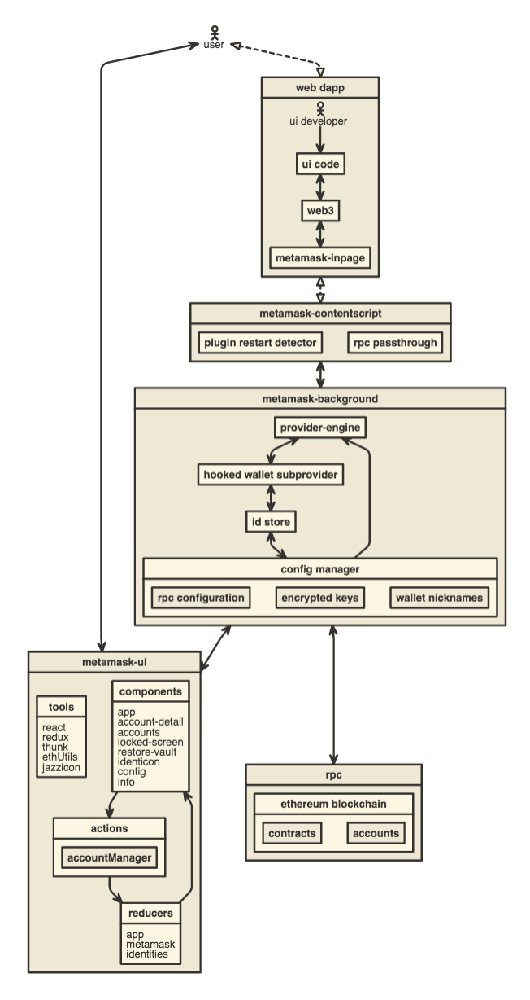

# PMetaMask Browser Extension

## Building locally

- Install [Node.js](https://nodejs.org) version 8 and the latest available npm@6
    - If you are using [nvm](https://github.com/creationix/nvm#installation) (recommended) running `nvm use` will automatically choose the right node version for you.
    - If you install Node.js manually, ensure you're using npm@6
        - Install npm@6 using `npm install -g npm@6`
- Install dependencies: `npm install`
    - If you have issues with node-sass compilation, try `npm rebuild node-sass`
- Install gulp globally with `npm install -g gulp-cli`.
- Build the project to the `./dist/` folder with `gulp build`.
- Optionally, to rebuild on file changes, run `gulp dev`.
- To package .zip files for distribution, run `gulp zip`, or run the full build & zip with `gulp dist`.

 Uncompressed builds can be found in `/dist`, compressed builds can be found in `/builds` once they're built.


### Running Tests

Requires `mocha` installed. Run `npm install -g mocha`.

Then just run `npm test`.

You can also test with a continuously watching process, via `npm run watch`.

You can run the linter by itself with `gulp lint`.

## Architecture

[][1]

## Development

```bash
npm install
npm start
```

## Build for Publishing

```bash
npm run dist
```

#### Writing Browser Tests

To write tests that will be run in the browser using QUnit, add your test files to `test/integration/lib`.

## Other Docs

- [How to add custom build to Chrome](./docs/add-to-chrome.md)


